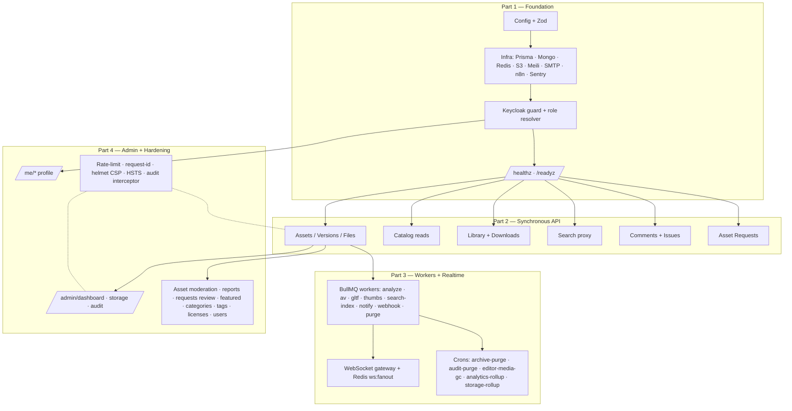

# MGM Asset Library — Backend

REST API for the **MGM Asset Library**, the centralized internal-only digital
asset library for the MGM research lab and its partners. This is one of four
independent repositories:

| Repo                            | Purpose                                                                    |
| ------------------------------- | -------------------------------------------------------------------------- |
| **mgm-asset-library-backend**   | This repo — API, DB, queues, search, file pipeline.                        |
| `mgm-asset-library-frontend`    | Next.js web UI served at `asset.labmgm.org`.                               |
| `mgm-asset-library-unity`       | Unity editor plugin (Window > MGM > Asset Library).                        |
| `mgm-asset-library-unreal`      | Unreal editor plugin.                                                      |

The backend speaks REST (documented via OpenAPI at `/docs`), publishes a
WebSocket gateway for in-app notifications, and runs BullMQ workers for the
file pipeline (analyzer, AV scan, GLTF conversion, thumbnail generation,
notification fan-out, archive purge).

## Overview



---

## 1. Feature

- **Admin namespace** under `/admin/*` (composite `AdminGuard` = Keycloak
  + admin role). Audit-logged via the global `AuditInterceptor` reading
  `@AuditAction({...})` markers.
- **Admin dashboard** at `/admin/dashboard` (counts, storage, charts,
  top-7d assets, recent audit). Cached 30 s.
- **Storage rollup** worker + `/admin/storage/users` + `/admin/storage/assets`.
- **Asset moderation**: cross-status list, edit-on-behalf, archive (with
  reason), restore, soft-delete, force-delete (`@RequireConfirmation`),
  transfer ownership.
- **Reports**: public `POST /reports` (rate-limited 5/user/day) + admin
  queue (list / detail / start-review / action with atomic asset side
  effect / dismiss).
- **Asset requests review**: admin transitions through IN_REVIEW →
  PENDING → APPROVED / REJECTED (rejection requires comment).
- **Featured slots**: list / create / update / delete / reorder + custom
  banner upload; cap of 5 active enforced.
- **Categories** admin CRUD + reorder + icon upload (≤256 KB).
- **Tags** admin: search with usage counts, merge, rename, delete-unused.
- **Licenses** admin CRUD (delete blocked while in use).
- **Users**: admin list + promote/demote (with `@RequireConfirmation`,
  bootstrap-admin protection, and a last-admin guard).
- **Audit log**: `/admin/audit` filtered + paginated.
- **AV queue**: `/admin/av/infected` + quarantine / acknowledge / rescan.
- **Analytics**: `/me/analytics/*` for contributors; `/admin/analytics/*`
  for the panel.
- **Profile**: `/me`, `/me/devices/:id/revoke`, `/me/logout`.
- **Hardening**: CSP locked down (Swagger UI scoped), HSTS in production,
  request-ID middleware + Pino correlation, `@RateLimit` decorator on
  abuse-prone surfaces, `@RequireConfirmation` for destructive ops.
- **E2E harness**: in-process `FakeKeycloak` + Testcontainers-style
  compose for Postgres/Redis/Mongo/MinIO/Meili. Five canonical scenarios
  shipped; the remaining 11 from the spec follow the same pattern (see
  `test/e2e/README.md`).
- **Production runbook**: `docs/RUNBOOK.md` covers architecture,
  provisioning, secrets, migrations, rollback, ops tasks, backups, DR,
  and monitoring.
- **PROCESS_ROLE split** (`api` | `worker`) — workers register every BullMQ
  processor; API replicas only enqueue. Two Docker images
  (`Dockerfile`, `Dockerfile.worker`).
- **File analysis pipeline** — extractors for `.unitypackage`, `.uplugin`,
  `.uproject`, FBX/OBJ/GLTF/BLEND, images, audio/video, code, archives.
  Per-file jobs fan in via a Redis counter to the version rollup which
  builds the manifest, writes Postgres + Mongo, and triggers conversion +
  reindex. `POST /assets/:id/versions/:vid/reanalyze` retries the whole
  version.
- **AV scanning** — ClamAV INSTREAM over TCP with a 500 MB streaming cap,
  per-file `meta.avResult`, version rollup that flips `avStatus` and
  emails owner + admins on `INFECTED`.
- **glTF conversion** — Blender → glTF-pipeline → `gltfpack` (with optional
  KTX2). Outputs live under
  `assets/{assetId}/v{semver}/__derived__/web-viewer/*.glb`.
- **Thumbnails** — variants worker renders six WebP sizes via `sharp`; the
  3D auto-render worker uses headless Eevee against the version's largest
  GLB and writes `Asset.thumbnailAutoGeneratedKey`.
- **Search indexer** — `SADD` set + 5-second batch worker mirrors per-asset
  documents (one per locale) plus the `tags` index.
- **Notifications** — 13 typed event payloads, MJML spec-driven email
  renderer (en/id), in-app + WS + email + n8n fan-out worker. WebSocket
  gateway at `/ws` with Keycloak or plugin-token handshake; cross-replica
  fan-out via the `ws:fanout` Redis pub/sub channel.
- **Cron maintenance** — archive-purge (S3 + Postgres + Meilisearch),
  audit-purge, editor-media GC (walks every TipTap doc), analytics rollup
  → `DownloadDaily` + `AssetStats`.
- **Ops surface** — `/admin/queues` Bull Board (admin-only),
  `/metrics` Prometheus endpoint (admin OR `METRICS_ALLOW_CIDRS`),
  `/admin/webhook-deliveries` log viewer.
- **Auth**: `/auth/me`, locale patch, plugin device-token flow (`exchange`,
  `refresh`, `revoke`, `devices`), `FlexibleAuthGuard` (Bearer **or**
  `PluginToken`).
- **Catalog reads**: `/categories`, `/tags`, `/licenses[/:id]`,
  `/users/search`, `/users/:id`.
- **Assets**: full CRUD lifecycle (create → upload → publish → archive →
  restore → soft-delete), detail, list with filters, `/discover` composite,
  `/assets/:id/recommended`, publish-checklist with AV-warning ack flow.
- **Versions**: nested under `/assets/:id/versions`; transactional `isLatest`
  swap; compatibility matrix CRUD.
- **Files**: single-shot + multipart presigned uploads, thumbnails, editor
  media (TipTap embeds). Completion callbacks enqueue analyzer + AV jobs.
- **Library / Downloads**: My Library list/save/hide, popup options endpoint,
  signed-URL issuance with Download row + LibraryItem auto-upsert.
- **Search**: Meilisearch-backed `/search/assets` + `/search/tags`.
- **Comments / Issues**: threaded reads (recursive CTE), depth-5 cap, Lite
  TipTap validation, author edits, admin soft-delete, issue status flow.
- **Asset Requests**: `POST /asset-requests`, list-own / list-all,
  `GET /asset-requests/:id`.
- **Workers**: Part 3 ships the processors.

---

## 2. Prerequisites

### 2.1 Development workstation

- **Node.js** ≥ 20
- **pnpm** ≥ 9 (`corepack enable && corepack prepare pnpm@latest --activate`)
- **Docker** ≥ 24 and **Docker Compose v2**
- **Git** ≥ 2.40

### 2.2 Server-side software (production / staging host)

The API container itself ships with only Node, `ca-certificates`, `curl`, and
`dumb-init`. The **worker container** that runs the BullMQ jobs.

This project needs the heavy media-processing toolchain installed. Run this once on every
worker host:

```bash
# ── Debian / Ubuntu (worker host) ────────────────────────────────────────────
sudo apt-get update
sudo apt-get install -y --no-install-recommends \
  ca-certificates curl gnupg dumb-init \
  blender clamav clamav-daemon clamav-freshclam \
  ffmpeg \
  python3 python3-venv python3-pip \
  build-essential

# Refresh ClamAV definitions and start the service.
sudo systemctl stop clamav-freshclam || true
sudo freshclam
sudo systemctl enable --now clamav-freshclam clamav-daemon

# Python environment for the analyzer worker (Trimesh + pyassimp).
sudo mkdir -p /opt/mgm-asset-library/venv
sudo chown "$USER" /opt/mgm-asset-library/venv
python3 -m venv /opt/mgm-asset-library/venv
source /opt/mgm-asset-library/venv/bin/activate
pip install --upgrade pip
pip install trimesh pyassimp

# Node-based tools used by the glTF pipeline.
sudo npm install -g gltf-pipeline gltfpack
```

Then point `.env` at the binaries:

```
BLENDER_BIN=/usr/bin/blender
CLAMSCAN_BIN=/usr/bin/clamscan
FFMPEG_BIN=/usr/bin/ffmpeg
```

The API host itself doesn't need any of this — only the worker host.

### 2.3 External services (provisioned out of band)

- **Keycloak** — managed by the platform team; we consume `KEYCLOAK_ISSUER_URL`
  + `KEYCLOAK_JWKS_URI` and never run a Keycloak container ourselves.
- **PostgreSQL 16**, **MongoDB 7**, **Redis 7**, **Meilisearch ≥ 1.10**,
  **S3 (or MinIO)** — separate compose stacks or managed services. Local dev
  spins these up in `docker-compose.yml`.
- **Mailtrap** SMTP creds for outbound mail.
- **n8n** webhook URL + secret for the outbound integration bus.

---

## 3. Local development

```bash
git clone git@github.com:MGM-Laboratory/mgm-asset-library-backend.git
cd mgm-asset-library-backend
cp .env.example .env       # fill in values; defaults match docker-compose.yml
pnpm install
docker compose up -d postgres mongo redis meilisearch minio
pnpm prisma migrate dev    # creates schema, generates the client
pnpm seed                  # bootstrap admin + categories + licenses
pnpm start:dev
```

Then:

- API listens on `http://localhost:4000`
- Swagger UI at `http://localhost:4000/docs`
- Liveness: `GET /healthz`
- Readiness: `GET /readyz`

Authenticate against `GET /auth/me` with a Keycloak-issued bearer token to
upsert your `User` row and confirm role resolution.

### MinIO local buckets

The MinIO container starts empty. Create the configured buckets once:

```bash
docker run --rm --network host minio/mc \
  alias set local http://localhost:9000 mgm mgm-secret
docker run --rm --network host minio/mc \
  mb -p local/mgm-asset-library-assets local/mgm-asset-library-thumbs local/mgm-asset-library-editor
```

---

## 4. Migrations

Prisma migrations live under `prisma/migrations/`. They are first-class — every
schema change is committed.

| Command                                       | Use                                                                       |
| --------------------------------------------- | ------------------------------------------------------------------------- |
| `pnpm prisma migrate dev --name <slug>`       | Create + apply a new migration locally.                                   |
| `pnpm prisma migrate deploy`                  | Apply pending migrations (CI / production entrypoint).                    |
| `pnpm prisma migrate status`                  | Inspect divergence between schema, migrations directory, and the DB.      |
| `pnpm prisma migrate resolve --rolled-back …` | Mark a failed migration as rolled back when manually reverted in the DB.  |

The deploy workflows run `pnpm prisma migrate deploy` inside the freshly built
image *before* traffic is swapped over.

---

## 5. Seeding

`pnpm seed` is idempotent. It:

1. Upserts a bootstrap admin keyed on `ADMIN_BOOTSTRAP_EMAIL`. The
   `keycloakSub` is a placeholder (`seed:<email>`); the auth guard overwrites
   it on the admin's first real login.
2. Upserts ten default categories with multilingual labels.
3. Upserts seven license templates (`MIT`, `CC0`, `CC-BY`, `CC-BY-SA`,
   `CC-BY-NC`, `COMMERCIAL`, `INTERNAL_USE_ONLY`).

Re-running is safe.

---

## 6. Search reindex

```bash
pnpm reindex
```

This script ensures the `assets` and `tags` indexes exist with the
canonical settings. In Part 3 the worker takes over runtime updates via a
debounced 5-second batch (see §1) — running `pnpm reindex` manually is now
reserved for cold-start / disaster recovery.

## 6a. Running the worker

```bash
# dev — alongside the API, using the worker overlay
docker compose -f docker-compose.yml -f docker-compose.worker.yml up

# prod — two separate images
docker compose -f docker-compose.prod.yml up -d
```

The worker exposes `/healthz` and `/metrics` on port 4001 only. `/readyz`
also reports `avDefinitionsUpdatedAt` so ops can watch freshclam staleness
without paging into the container. The Prometheus scrape endpoint is gated
by `METRICS_ALLOW_CIDRS` (admin Keycloak tokens are also accepted).

Operational UI: `GET /admin/queues` (Bull Board, admin-only) and
`GET /admin/webhook-deliveries` (Mongo-backed n8n delivery log).

---

## 7. Environment reference

See [`.env.example`](.env.example) for the canonical, commented list of every
variable. Highlights:

| Group              | Required in dev? | Notes                                                                   |
| ------------------ | ---------------- | ----------------------------------------------------------------------- |
| Runtime            | yes              | `NODE_ENV`, `PORT`, `PUBLIC_BASE_URL`, `CORS_ORIGINS`.                   |
| Postgres / Mongo   | yes              | Compose defaults work out of the box.                                   |
| Redis              | yes              | Used by BullMQ in Part 3 + JWKS cache.                                  |
| Keycloak           | yes              | `KEYCLOAK_ISSUER_URL`, `KEYCLOAK_AUDIENCE`, `KEYCLOAK_JWKS_URI`.        |
| S3                 | yes              | Local: MinIO at `http://minio:9000`; production: AWS S3 endpoint blank. |
| Meilisearch        | yes              | Master key optional in dev.                                             |
| Mailtrap           | optional         | Blank `SMTP_HOST` makes mailer a no-op.                                 |
| n8n                | optional         | Blank URL makes webhook a no-op.                                        |
| Sentry             | optional         | Blank DSN disables telemetry.                                           |
| Plugin tokens      | prod only        | `PLUGIN_TOKEN_PEPPER` is required (≥ 16 chars) when `NODE_ENV=production`. |
| Feature flags      | —                | `FEATURE_SWAGGER_PUBLIC` gates `/docs` in production.                   |

Boot fails fast with a single aggregated error if anything is missing or
malformed; refer to `src/config/env.schema.ts` for the authoritative shape.

---

## 8. Deployment

### 8.1 Build & push the image

GitHub Actions does this on every push to `staging` / `production`:

```
.github/workflows/deploy-staging.yml  → ghcr.io/<org>/mgm-asset-library-backend:staging-<sha>
.github/workflows/deploy-prod.yml     → ghcr.io/<org>/mgm-asset-library-backend:prod-<sha>
```

### 8.2 Wiring SWAG (nginx) on the production host

SWAG terminates TLS and proxies to the API container on `PORT`. A minimal
server block:

```nginx
location / {
  proxy_pass http://127.0.0.1:4000;
  proxy_set_header Host $host;
  proxy_set_header X-Real-IP $remote_addr;
  proxy_set_header X-Forwarded-For $proxy_add_x_forwarded_for;
  proxy_set_header X-Forwarded-Proto $scheme;
  proxy_read_timeout 60s;
}
```

`TRUST_PROXY=true` in `.env` is what tells Fastify to honour the
`X-Forwarded-*` headers SWAG sets.

### 8.3 Env management

We recommend **sops + age** committed to a private ops repo, or `--env-file` on
the host with strict file permissions (`chmod 600 .env`). The deploy
workflows assume `.env` already lives at `/srv/mgm-asset-library-backend/.env`
on the target host.

---

## 9. CI/CD overview

| Workflow                              | Trigger                                       | Purpose                                                            |
| ------------------------------------- | --------------------------------------------- | ------------------------------------------------------------------ |
| `.github/workflows/ci.yml`            | PR or push to `staging` / `production`        | Install → lint → typecheck → test → build → docker build (no push) |
| `.github/workflows/deploy-staging.yml`| Push to `staging`                             | Build + push image; SSH; `prisma migrate deploy`; restart compose. |
| `.github/workflows/deploy-prod.yml`   | Push to `production` (needs manual approval)  | Same flow as staging, against the production environment.          |

### Branch protection rules (set up by the repo admin in GitHub)

- `staging` and `production` are protected.
- Updates only via pull request.
- CI must pass.
- At least one approving review required.

---

## 10. Endpoint reference

### Auth
- `GET /auth/me` — current user + role + avatar + counters.
- `PATCH /auth/me/locale` — persist `{ locale: 'en'|'id' }`.
- `POST /auth/plugin/exchange` — exchange a Keycloak token for a device token.
- `POST /auth/plugin/refresh` — slide a device token's expiry.
- `GET  /auth/plugin/devices` — list the user's active plugin devices.
- `POST /auth/plugin/revoke`, `DELETE /auth/plugin/devices/:id` — revoke.

### Users
- `GET /users/search?q=…` — admin-only typeahead.
- `GET /users/:id` — public profile.

### Catalog
- `GET /categories[?locale=]`, `GET /tags?q=&limit=`, `GET /licenses[/:id]`.

### Assets
- `GET /discover[?locale=]` — landing-page composite (featured + per-category rows), cached 30 s per locale.
- `GET /assets` — filterable list with cursor pagination.
- `GET /assets/:idOrSlug` — full detail; guests see published only.
- `POST /assets`, `PATCH /assets/:id`, `DELETE /assets/:id` — create/update/soft-delete.
- `POST /assets/:id/publish` — requires the checklist to pass; pass `{ confirmInfectedWarning: true }` to ack AV warnings.
- `POST /assets/:id/archive`, `POST /assets/:id/restore`.
- `GET /assets/:id/recommended` — six related assets.

### Versions
- `GET /assets/:id/versions`, `POST /assets/:id/versions`, `PATCH /assets/:assetId/versions/:vid`.
- `POST /assets/:assetId/versions/:vid/publish` — flips isLatest in a transaction.
- `POST /assets/:assetId/versions/:vid/compatibility` — replace the engine matrix.

### Files
- `POST /files/uploads/initiate` + `/complete` — single-shot ≤ 100 MB.
- `POST /files/uploads/multipart/initiate|sign|complete|abort` — large files.
- `POST /files/thumbnails/initiate|complete` — asset thumbnails.
- `POST /files/editor-media/initiate` — TipTap inline media.

### Library + Downloads
- `GET /library`, `POST /library/items`, `DELETE /library/items/:assetId`, `PATCH /library/items/:assetId`.
- `GET /downloads/options?assetId=&versionId=` — popup data, no writes.
- `POST /downloads` — issues signed URLs and records the download.

### Search
- `GET /search/assets?q=…` (filters: `engine`, `categoryIds`, `tags`, `fileKinds`, `renderPipelines`, `targets`, `licenseSlug`, `locale`, `limit`, `offset`).
- `GET /search/tags?q=…` — Meilisearch-backed fuzzy autocomplete.

### Comments + Issues
- `GET /assets/:id/comments[?cursor=&kind=COMMENT|ISSUE|ALL]` — threaded tree.
- `POST /assets/:id/comments` — Lite TipTap, depth ≤ 5.
- `PATCH /comments/:id` — author edit. `DELETE /comments/:id` — admin only.
- `PATCH /comments/:id/status` — issue status (owner or admin).

### Asset requests
- `POST /asset-requests`, `GET /asset-requests`, `GET /asset-requests/:id`.

### Versions (Part 3 addition)
- `POST /assets/:assetId/versions/:vid/reanalyze` — re-run analyzer + AV scan
  on every file in the version (used after a transient `analyzer.failed`).

### Notifications (Part 3)
- `GET /notifications[?cursor=&limit=&unreadOnly=]` — paginated inbox.
- `GET /notifications/unread-count` — cheap badge counter.
- `POST /notifications/:id/read`, `POST /notifications/read-all`.

### Realtime (Part 3)
- `WSS /ws` — auth via `?token=<keycloakToken>` or `?pluginToken=<deviceToken>`.
  See [WS_PROTOCOL.md](./WS_PROTOCOL.md) for the message envelope.

### Operational (admin-only)
- `GET /admin/queues` — Bull Board.
- `GET /admin/webhook-deliveries[?status=&type=&limit=]` — n8n delivery log.
- `GET /metrics` — Prometheus scrape (admin role OR `METRICS_ALLOW_CIDRS`).

### Admin namespace
All endpoints below mount under `/admin/*`, guarded by `AdminGuard`
(Keycloak Bearer + `User.isAdmin`). Mutating handlers carry
`@AuditAction(...)` so every change lands in `AuditLog`.

- `GET /admin/dashboard` — composite home payload (counts / storage /
  charts / top-7d / recent audit).
- `GET /admin/storage/users[?date=&limit=]`, `GET /admin/storage/assets`.
- `GET /admin/assets[?...]` — list every status with `X-Total-*` headers.
- `GET /admin/assets/:id`, `PATCH /admin/assets/:id` — edit on behalf.
- `POST /admin/assets/:id/archive|restore`, `DELETE /admin/assets/:id` —
  with mandatory `reason`.
- `POST /admin/assets/:id/force-delete` — `@RequireConfirmation`.
- `POST /admin/assets/:id/transfer` — reassign ownership.
- `GET /admin/reports[?status=&category=]`, `GET /admin/reports/:id`.
- `POST /admin/reports/:id/{start-review,action,dismiss}`.
- `GET /admin/asset-requests`, `PATCH /admin/asset-requests/:id`.
- `GET/POST/PATCH/DELETE /admin/featured`, `POST /admin/featured/reorder`,
  `POST /admin/featured/banner-uploads/initiate`.
- `GET/POST/PATCH/DELETE /admin/categories`,
  `POST /admin/categories/reorder`, `POST /admin/categories/icon-uploads/initiate`.
- `GET /admin/tags`, `POST /admin/tags/merge`, `PATCH/DELETE /admin/tags/:id`.
- `GET/POST/PATCH/DELETE /admin/licenses`.
- `GET /admin/users`, `POST /admin/users/:id/promote`,
  `POST /admin/users/:id/demote` (both `@RequireConfirmation`).
- `GET /admin/audit[?actorId=&action=&from=&to=]`, `GET /admin/audit/:id`.
- `GET /admin/av/infected`, `POST /admin/av/:versionId/{quarantine,acknowledge,rescan}`.
- `GET /admin/analytics/platform`, `/admin/analytics/assets`, `/admin/analytics/users`.

### Profile + analytics for the authenticated user
- `GET /me` — extends `/auth/me` with the device list.
- `POST /me/devices/:id/revoke`, `POST /me/logout`.
- `GET /me/analytics/summary`, `GET /me/analytics/assets/:assetId`.

### Rate-limited surfaces (Part 4 §17.1)
| Endpoint                       | Window | Max | Scope |
| ------------------------------ | ------ | --- | ----- |
| `POST /reports`                | 24 h   | 5   | user  |
| `POST /asset-requests`         | 24 h   | 20  | user  |
| `POST /comments`               | 60 s   | 60  | user  |
| `POST /auth/plugin/exchange`   | 60 s   | 20  | ip    |

## 11. Quickstart — publishing your first asset (curl)

The flow exercised by Part 2 integration tests. Replace `$TOKEN` with a valid
Keycloak bearer token (use any IdP-managed user for staging/dev).

```bash
API=https://asset-api.labmgm.org
H="Authorization: Bearer $TOKEN"
J="Content-Type: application/json"

# 1) Bootstrap — confirm who you are.
curl -s -H "$H" "$API/auth/me" | jq .

# 2) Look up the IDs you'll reference.
CAT_ID=$(curl -s -H "$H" "$API/categories" | jq -r '.[0].id')
LIC_ID=$(curl -s -H "$H" "$API/licenses" | jq -r '.[0].id')

# 3) Create the draft (note the Idempotency-Key for safe retries).
CREATE=$(curl -s -X POST "$API/assets" \
  -H "$H" -H "$J" -H "Idempotency-Key: $(uuidgen)" \
  -d "{
    \"title\": \"Crazy Sword Pack\",
    \"engine\": \"UNITY\",
    \"categoryId\": \"$CAT_ID\",
    \"licenseId\": \"$LIC_ID\",
    \"semver\": \"1.0.0\",
    \"translations\": [
      { \"locale\": \"en\", \"shortDescription\": \"Stylized sword bundle.\",
        \"longDescription\": {\"type\":\"doc\",\"content\":[
          {\"type\":\"paragraph\",\"content\":[{\"type\":\"text\",\"text\":\"5 swords, PBR.\"}]}
        ]} }
    ],
    \"tags\": [\"swords\", \"weapons\"]
  }")
ASSET_ID=$(echo "$CREATE" | jq -r .id)

# 4) Initiate the thumbnail upload and PUT to the URL S3 returned.
THUMB=$(curl -s -X POST "$API/files/thumbnails/initiate" -H "$H" -H "$J" \
  -d "{\"assetId\":\"$ASSET_ID\",\"contentType\":\"image/png\",\"bytes\":12345}")
curl -s -X PUT --upload-file ./thumb.png -H "Content-Type: image/png" \
  "$(echo "$THUMB" | jq -r .putUrl)"
curl -s -X POST "$API/files/thumbnails/complete" -H "$H" -H "$J" \
  -d "{\"assetId\":\"$ASSET_ID\",\"key\":\"$(echo "$THUMB" | jq -r .key)\"}"

# 5) Initiate, upload, complete a file (single-shot, < 100 MB).
VID=$(curl -s -H "$H" "$API/assets/$ASSET_ID/versions" | jq -r '.[0].id')
UP=$(curl -s -X POST "$API/files/uploads/initiate" -H "$H" -H "$J" \
  -d "{\"assetId\":\"$ASSET_ID\",\"versionId\":\"$VID\",
        \"relativePath\":\"SwordPack.unitypackage\",
        \"contentType\":\"application/octet-stream\",\"bytes\":$(stat -c %s ./pkg.unitypackage)}")
curl -s -X PUT --upload-file ./pkg.unitypackage \
  -H "Content-Type: application/octet-stream" "$(echo "$UP" | jq -r .putUrl)"
curl -s -X POST "$API/files/uploads/complete" -H "$H" -H "$J" \
  -d "{\"uploadId\":\"$(echo "$UP" | jq -r .uploadId)\"}"

# 6) Set compatibility for the latest version.
curl -s -X POST "$API/assets/$ASSET_ID/versions/$VID/compatibility" -H "$H" -H "$J" \
  -d '{"rows":[{"engineVersion":"6000.1.14f1","renderPipelines":["URP"],"targets":["WINDOWS","MAC"]}]}'

# 7) Publish. (When the analyzer is stubbed READY in tests, this succeeds.)
curl -s -X POST "$API/assets/$ASSET_ID/publish" -H "$H" -H "$J" -d '{}'

# 8) Confirm it lights up Discover.
curl -s -H "$H" "$API/discover" | jq '.rows[].assets[].slug'
```

A consumer can now `POST /downloads` with the asset/version to get signed
file URLs and have the asset auto-saved to their Library.

## 12. Coding conventions

- TypeScript strict mode, ESLint + Prettier, Husky pre-commit running
  lint-staged.
- Conventional Commits — CI rejects non-conforming messages on `staging` and
  `production` PRs.
- No `console.log` in committed code; use the Pino logger via `nestjs-pino`.
- DTOs in each module's `dto/` folder, validated by the global
  `ValidationPipe` (whitelist + forbidNonWhitelisted).
- All list endpoints use cursor pagination (`{ items, nextCursor, hasMore }`).
  Cursors are base64url JSON of `{ createdAt, id }`.
- All timestamps in API responses are ISO 8601 UTC strings.
- Mutating admin handlers carry `@Audit('verb.subject')` markers; the audit
  interceptor wires them through in Part 4.
