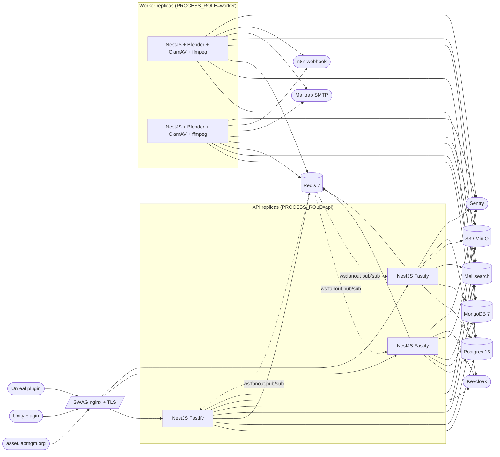

# MGM Asset Library — Backend production runbook

Operator-facing reference for everything you need to deploy, observe, and
recover the backend. Pair with the README for development setup.

## 1. Architecture



- API replicas are stateless; scale horizontally behind SWAG.
- Workers consume from the shared Redis (BullMQ); cron tasks land on a
  single worker via BullMQ's repeatable-job dedup.
- Postgres + Mongo + Redis + Meilisearch + S3 are managed externally
  (separate compose stacks or managed services).
- Keycloak is owned by the platform team; the backend only verifies tokens.

## 2. First-time provisioning

### 2.1 API host

Plain Linux VM with Docker + Docker Compose:

```bash
sudo apt-get update
sudo apt-get install -y docker.io docker-compose-plugin
sudo usermod -aG docker deploy
sudo mkdir -p /srv/mgm-asset-library-backend
sudo chown deploy:deploy /srv/mgm-asset-library-backend
```

Drop `.env` (see `secrets management` below), `docker-compose.prod.yml`,
and you're done. The image is pulled by the GitHub Actions deploy job.

### 2.2 Worker host

Worker images ship the heavy toolchain (Blender, ClamAV, ffmpeg, Python
venv with `trimesh`/`pyassimp`/`pillow`, `gltf-pipeline`, `gltfpack`).
**Nothing additional needs to be installed on the host** — the container
contains it all. See `Dockerfile.worker` for the canonical list.

If you prefer running outside Docker, replicate that block on the host
verbatim from README §2.2 + Part 3 §14.

### 2.3 External services

| Service        | Notes                                                                                                 |
| -------------- | ----------------------------------------------------------------------------------------------------- |
| Postgres 16    | Logical replication-ready; enable `pg_stat_statements`.                                              |
| MongoDB 7      | Single replica set OK; TTL index on `webhook_deliveries.createdAt` is set at app init.                |
| Redis 7        | AOF on (BullMQ relies on persistence). Separate DB number per env (use `?db=0` / `?db=9` for E2E).    |
| Meilisearch    | At least 1.10. Disk-backed; rebuildable from `pnpm reindex` if corrupted.                             |
| S3 (or MinIO)  | Versioning **on** for `assets`; **off** is fine for `thumbs` and `editor-media`.                      |
| Keycloak       | Realm `mgm`, client `mgm-asset-library`. Access-token TTL 30 days; refresh-token TTL 365 days.        |

## 3. Secrets management

Recommend [`sops` + `age`](https://github.com/getsops/sops) committed to a
private ops repo:

```bash
# One-time on each host:
sudo install -m 600 /dev/stdin /etc/mgm/age.key < <(age-keygen)
# In the ops repo:
sops -e -i .env.production.sops.yaml
# Decrypt to host at deploy time:
sops -d .env.production.sops.yaml > /srv/mgm-asset-library-backend/.env
chmod 600 /srv/mgm-asset-library-backend/.env
```

Docker Compose v2 also supports the `secrets:` block — fine if your stack
runs in Swarm or similar. Avoid plaintext env files in source control.

## 4. Migrations

```bash
# Inside the freshly built image, before swapping traffic:
docker run --rm --env-file .env $IMAGE pnpm prisma migrate deploy
```

`prisma migrate deploy` is what the `deploy-staging.yml` / `deploy-prod.yml`
workflows run automatically. Migrations are forward-only — see Rollback for
emergency reversal.

## 5. Rollback

The image tag is the rollback unit. Every deploy logs the tag to
`/srv/mgm-asset-library-backend/.image-tag` on the host. To roll back:

```bash
cd /srv/mgm-asset-library-backend
export IMAGE=ghcr.io/mgm-laboratory/mgm-asset-library-backend:prod-<prev-sha>
docker compose -f docker-compose.prod.yml pull
docker compose -f docker-compose.prod.yml up -d
```

**Database migrations are forward-only.** If a migration introduced a
breaking schema change AND the previous app image cannot read the new
schema, you must roll the DB back too. Procedure:

1. `pg_restore` from last night's backup (see §8).
2. Mark the rolled-back migrations in `_prisma_migrations` as
   `rolled_back`.
3. Re-deploy the previous image.

This is rare but worth practicing in staging once a quarter.

## 6. Health-check expectations

| Probe       | Purpose                                                                                |
| ----------- | -------------------------------------------------------------------------------------- |
| `/healthz`  | Liveness. Always 200 while the process is alive. Use for orchestration restart.        |
| `/readyz`   | Readiness. 200 only when every downstream is reachable. Use as load-balancer gate.     |
| `/metrics`  | Prometheus scrape. Allowed via admin token or `METRICS_ALLOW_CIDRS`.                   |

## 7. Common ops tasks

| Task                         | How                                                                                                  |
| ---------------------------- | ---------------------------------------------------------------------------------------------------- |
| Reindex Meilisearch          | `pnpm reindex` (or `POST /admin/queues` → search-index queue → drain).                                |
| Replay a failed webhook      | `/admin/queues/webhook` → click the failed job → Retry.                                              |
| Force-rescan a version       | `POST /admin/av/:versionId/rescan`.                                                                  |
| Inspect why analyzer failed  | Sentry → BullMQ dashboard → Mongo `analysis_reports` (per-version dump).                              |
| Refresh ClamAV definitions   | Worker container's freshclam daemon runs every 12 h; `/readyz` surfaces `avDefinitionsUpdatedAt`.    |
| Promote an admin             | `POST /admin/users/:id/promote` with confirmation body. See README §11.                              |
| Roll up storage immediately  | `/admin/queues/storage-rollup` → Add → empty payload.                                                |
| Inspect audit                | `GET /admin/audit?actorId=…&action=…` (retention is 30 days; older rows are purged by cron).         |

## 8. Backup policy

| Source             | Cadence       | Retention | How                                                          |
| ------------------ | ------------- | --------- | ------------------------------------------------------------ |
| Postgres           | Nightly       | 14 days   | `pg_dump` + S3 lifecycle policy.                             |
| MongoDB            | Weekly        | 30 days   | `mongodump` (collections are small).                         |
| S3 `assets` bucket | Continuous    | versioning | S3 object versioning + lifecycle to Glacier after 90 days. |
| Meilisearch        | None          | —         | Rebuildable from `pnpm reindex`.                             |
| Redis              | None required | —         | Queues + caches; recreate from durable sources.              |
| Audit              | n/a           | 30 days   | Lives in Postgres; backed up with the rest.                  |

## 9. Disaster recovery

Restore order: Postgres → Mongo → Meilisearch (full reindex) → resume
traffic. The S3 assets are authoritative — they should never need to be
restored as long as versioning is on.

```bash
# Restore Postgres (point-in-time if WAL-G is configured, otherwise
# nightly dump):
pg_restore -d mgm_asset_library /var/backups/postgres/2026-05-19.dump

# Restore Mongo:
mongorestore --uri "$MONGO_URL" /var/backups/mongo/2026-05-14

# Rebuild Meilisearch from Postgres:
docker run --rm --env-file .env "$IMAGE" pnpm reindex
```

If the worker host is the only host that died, no DR is needed — bring up
a fresh worker container; in-flight BullMQ jobs are durable in Redis and
will resume automatically.

## 10. Monitoring

| Signal                            | Where                                                                  |
| --------------------------------- | ---------------------------------------------------------------------- |
| Unhandled errors                  | Sentry (`SENTRY_DSN`).                                                 |
| Queue depths / job failures       | Bull Board at `/admin/queues`; Prometheus via `/metrics`.              |
| HTTP latency / status mix         | Pino logs aggregated by your log pipeline (Loki, Cloud Logging, etc.). |
| AV definitions freshness          | Worker `/readyz` → `avDefinitionsUpdatedAt`.                           |
| n8n delivery failures             | `/admin/webhook-deliveries?status=failure` (admin UI).                 |

Alerts to set up:

- BullMQ `failed` count rising for > 5 minutes — usually a downstream
  outage (S3 / Meili / clamd).
- `/readyz` flapping for > 2 minutes — page the on-call.
- AV definitions stale > 36 h — page during business hours.
- Webhook delivery failure rate > 10 % over 1 h — n8n is probably down.

## 11. Branching + release cadence

- `staging` is the integration branch. Every merge auto-deploys to the
  staging environment and runs the smoke E2E subset.
- `production` requires a manual GitHub Actions approval. Promote by
  cutting a PR `staging → production` once smoke tests are green.
- Branch protection: protected refs, required reviews, required CI green.
